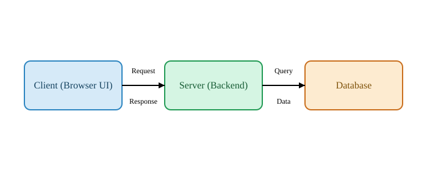

# 📊 Finova Data Viewer — Project Report

## 📌 Overview
**Finova Data Viewer** is a static frontend user interface built using **HTML and CSS only**.  
This project demonstrates an understanding of **client–server architecture**, **full-stack application flow**, and **basic Git workflow**.  
The UI created in this task will be reused and extended with API functionality in **Task 2**.

---

## 🛠 Steps Taken
1. Designed a clean FinTech user interface using HTML and CSS.
2. Structured the project for future backend and API integration.
3. Created this README with clear explanations of:
   - Client–Server Model
   - Full-Stack Application Architecture
4. Used Git for version control and GitHub for repository management.

---

## 1️⃣ Client–Server Model

### 🔹 What is a Client?
A **client** is the software that users interact with directly.
- Runs in a web browser or mobile application
- Displays the user interface
- Sends requests to a server

In this project, the **HTML + CSS UI running in the browser** acts as the client.

---

### 🔹 What is a Server?
A **server** is a program that:
- Receives requests from clients
- Processes business logic
- Communicates with databases
- Sends responses back to clients

Servers usually run on remote machines or cloud platforms.

---

### 🔹 How Do Clients and Servers Communicate?
Clients and servers communicate over a network using **HTTP/HTTPS**:
- The client sends a request (GET or POST)
- The server processes the request
- The server sends a response containing data or status

Data is commonly exchanged in formats such as **JSON**.

---

### 🔹 What Happens When a User Clicks “Search”?

1. The frontend captures the button click.
2. The input value entered by the user is read.
3. A request is sent to a backend API endpoint.
4. The server validates the request.
5. The server queries the database for relevant data.
6. The database returns results to the server.
7. The server sends a formatted response.
8. The frontend receives the response and updates the UI.

---

## 2️⃣ How Full-Stack Applications Work 

### 🔹 Frontend
- The visual part of the application
- Built using HTML, CSS, and JavaScript
- Handles layout, styling, and user interaction
- **This project uses only HTML and CSS**

---

### 🔹 Backend
- Runs on the server
- Handles application logic
- Processes requests from the frontend
- Communicates with the database

---

### 🔹 Database
- Stores data permanently
- Examples include PostgreSQL, MySQL, MongoDB
- Accessed only by the backend

---

### 🔹 APIs
- APIs define how frontend and backend communicate
- They specify:
  - Endpoints
  - Request structure
  - Response format
- APIs act as a bridge between layers

---

### 🔹 Communication Between Layers
- Frontend → API → Backend → Database
- Database → Backend → API → Frontend

Each layer has a specific responsibility, making applications scalable and maintainable.

---

## 3️⃣ Architecture Diagram

The system architecture diagram shows:
- Client
- Server
- Database
- Flow of data between components

---

## 4️⃣ Screenshots

### 🔹 UI Screenshot

---

### 🔹 Git Commands Screenshot

 

